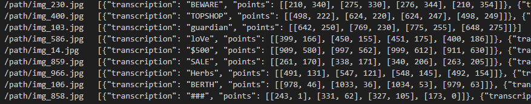
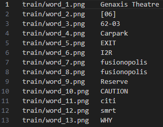
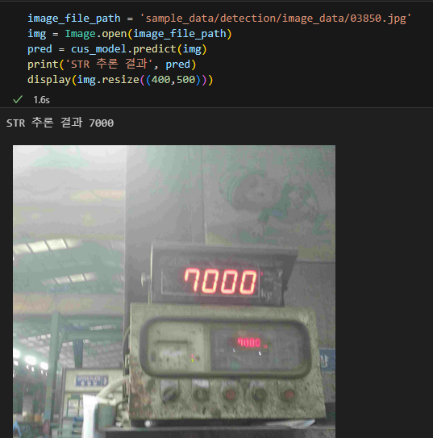
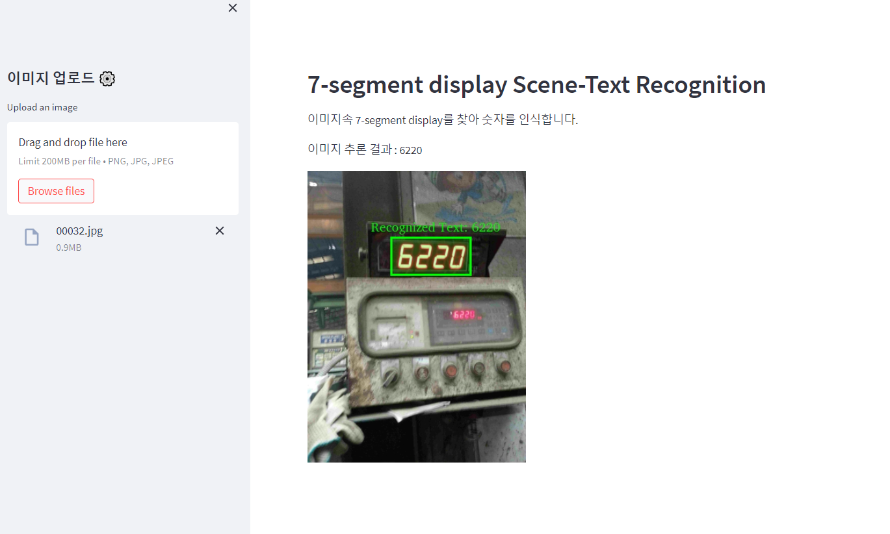

# 제조현장용 7-segment 데이터에 특화된 PaddleOCR기반 Scene-Text Recognition 모델

이 레포지토리는 제조 현장에서 사용되는 7-segment 데이터셋에 최적화된 [PaddleOCR](https://github.com/PaddlePaddle/PaddleOCR/blob/release/2.7/doc/doc_i18n/README_%ED%95%9C%EA%B5%AD%EC%96%B4.md)기반의 Scene-Text Recognition (STR) 모델 학습 및 추론 코드를 제공합니다. 

써로마인드와 부경대학교가 진행한 산학협력 프로젝트의 결과물로써, 7-segment 디스플레이가 이미지가 포함된 이미지로 파인튜닝된 모델을 제공합니다.

### 모델 정보:
------------------ 

Scene-Text Recognition 기술은 일상적인 풍경이나 장면 속 이미지에서 글자를 정확하게 인식하는 고급 Optical Character Recognition (OCR) 기술을 말합니다. 이는 전통적인 OCR 기술이 종이 문서에서 글자를 인식하는 데 집중하는 것을 넘어서, 다양한 배경과 환경에서 글자를 추출할 수 있게 해줍니다.

PaddleOCR은 중국의 바이두(Baidu)에 의해 개발된 오픈 소스 OCR 프레임워크입니다. 이 프레임워크는 바이두의 PaddlePaddle 딥러닝 플랫폼을 기반으로 구축되었으며, 다양한 언어와 형식의 문서로부터 텍스트를 추출하는 작업을 자동화하는 데 사용됩니다.

PaddleOCR의 STR(Scene-Text Recognition) 모델은 텍스트 감지와 텍스트 인식, 두 주요 단계로 구성됩니다:

텍스트 감지(Text Detection): 이미지 내에서 텍스트가 위치한 영역을 정확하게 식별합니다.
텍스트 인식(Text Recognition): 식별된 텍스트 영역 내의 문자를 인식하고, 이를 디지털 텍스트 형태로 변환합니다.

추론은 별도로 훈련시킨 두 모델을 순차적으로 진행하며 이뤄지고 현재 모델은 주로 숫자 인식에 초점을 맞추고 있지만, 학습 데이터에 한글, 영어 등 다양한 언어의 텍스트를 포함시켜 모델의 범용성을 확장할 수 있습니다. 

본 모델은 390장의 테스트 데이터셋에 대하여 94.87%의 정확도를 달성했습니다.

## 프레임워크 정보: 
+ Python 3.7.13
+ paddlepaddle-gpu 2.3.0
+ paddleocr 2.7.0.2

## 파인튜닝 데이터에 대한 설명:

본 레포지토리에서 제공하는 모델은 제조현장용 Scene-Text Recognition 학습 AI 데이터셋(7-segment)으로 파인튜닝 되었습니다.

데이터는 이미지(jpg)와 해당 이미지의 라벨링파일(txt)로 구성되어 있습니다. 
각 이미지 내 7-segment 이미지에 대해서는 bounding box 좌표와 숫자가 포함된 라벨링 정보가 제공됩니다. 
본 레포지토리에서는 파인 튜닝을 위해 data를 paddleocr의 요구형식에 맞게 가공하여 사용했으며, 원본 데이터는 [KMAP](https://www.kamp-ai.kr/aidataDetail?AI_SEARCH=scene&page=1&DATASET_SEQ=16&EQUIP_SEL=&GUBUN_SEL=&FILE_TYPE_SEL=&WDATE_SEL=)에서 다운로드 받을 수 있습니다.

## 환경 설정
### 1. packages 설치

Install dependencies with the following command:

```bash
pip3 install -r requirements.txt
```
### 학습 준비:
------------------  
#### 필수 라이브러리 설치 
학습을 시작하기 전 필요한 라이브러리를 설치하세요
```bash
pip3 install -r requirements.txt
```   
#### 데이터 셋 준비 
본 모델은 Detection 모델과 Recognition 모델이 결합된 형태로, 본인의 커스텀 데이터로 새로 훈련하려면 두 가지 모델을 훈련하기 위한 데이터를 각각 준비해야 합니다. 
sample_data 폴더를 참조해주세요
1. Detection 모델 : 글자(숫자)가 포함된 이미지, 라벨 txt 파일
2. Recognition 모델 : 글자(숫자)부분만 잘려진 이미지, 라벨 txt 파일 

예시는 다음과 같습니다. 

1. Detection 모델의 label 파일 예시
-----------------
 


2. Recognition 모델의 label 파일 예시
-----------------
 

## 훈련 및 추론 코드 사용 가이드 

### 학습 시작 방법:
------------------
학습은 커맨드라인에서 아래 명령어를 통해 진행됩니다. yml 파일 내부의 데이터 폴더 경로 등을 잘 확인해 주세요


```bash
# Detection 모델 훈련
python3 PaddleOCR/tools/train.py -c config/detection/det_custom.yml
```

```bash
# Recognition 모델 훈련 
python3 PaddleOCR/tools/train.py -c config/recognition/rec_custom.yml
```

### 4. 추론 
------------------
두 모델의 학습이 각각 완료되었다면, inference.py 파일에서 임의의 1개 데이터에 대하여 바로 추론 가능합니다. 

inference.py 사용법: python3 inference.py --img_path {이미지 경로} 
 
```bash
ex) python3 inference.py --img_path sample_data/detection/image_data/01511.jpg
```

입력 및 추론 결과 예시 
-----------------


### 데모 실행
------------------ 
demo 폴더 내 'app.py' 파일을 다음 명령어를 사용하여 실행하면, 웹페이지를 통해 모델을 직접 테스트해 볼 수 있습니다. 
```bash
streamlit run demo/app.py
```
 

## Reference
- [PaddleOCR 공식문서](https://github.com/PaddlePaddle/PaddleOCR/blob/release/2.7/doc/doc_i18n/README_%ED%95%9C%EA%B5%AD%EC%96%B4.md)

## License
Apache License 2.0